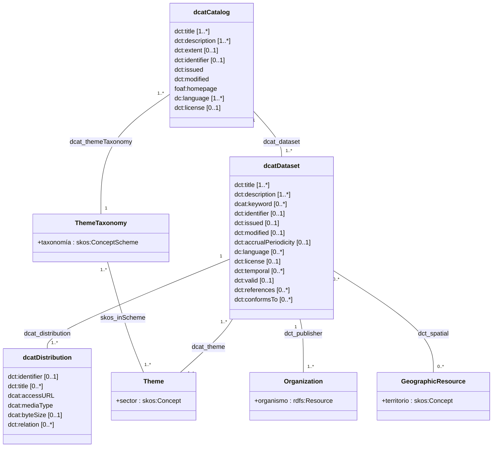

# Introducción
La [Norma Técnica de Interoperabilidad de Reutilización de Recursos de Información (NTI-RISP)](https://www.boe.es/eli/es/res/2013/02/19/(4)) establece un marco esencial para la descripción estandarizada de información pública que puede ser reutilizada. El apartado V de esta norma define las directrices fundamentales para la correcta descripción de los datos publicados por organismos públicos, facilitando su clasificación, descubrimiento y posterior aprovechamiento.

Este apartado establece tres principios básicos:

1. **Metadatos obligatorios**: Todos los documentos y recursos de información reutilizables deben asociarse con un conjunto de metadatos mínimos, detallados en el anexo III de la norma. Estos metadatos permiten describir adecuadamente los conjuntos de datos disponibles para su reutilización.

2. **Descripción de distribuciones**: Cada distribución de un conjunto de datos (es decir, cada formato en que se proporciona) debe contar con sus propios metadatos descriptivos especificados en el mismo anexo III.

3. **Uso de vocabularios controlados**: Para garantizar la interoperabilidad semántica, los metadatos se basan en estándares como DCAT (Dataset Catalog) y Dublin Core, entre otros. La norma recomienda el uso del Centro de Interoperabilidad Semántica de la Administración para la publicación y gestión de los vocabularios utilizados.

Este enfoque estructurado de metadatos facilita la publicación de datos en formatos abiertos y reutilizables, permitiendo a ciudadanos, empresas y otros organismos localizar, entender y aprovechar la información pública de manera eficiente y estandarizada.

!!! warning "Advertencia sobre este documento"
    Este documento **NO sustituye a la [guía oficial de aplicación de la NTI-RISP](https://datos.gob.es/sites/default/files/doc/file/guia_nti_pdf_reutilizacion_recursos_informacion_2aed.pdf)** ni a la información publicada en el BOE en vigor ([Resolución de 19 de febrero de 2013](https://www.boe.es/eli/es/res/2013/02/19/(4))). 
    
    Es un **material únicamente complementario** y tiene como objetivo facilitar la implementación práctica del modelo de metadatos de la NTI-RISP de 2013, proporcionando referencias y ejemplos adicionales. Para cualquier interpretación normativa o implementación oficial, debe consultarse siempre la documentación legal vigente y las guías oficiales publicadas por el organismo competente.

!!! danger "DCAT-AP-ES"
    **[DCAT-AP-ES](https://datosgobes.github.io/DCAT-AP-ES) entrará en vigor en 2025**, tras la aprobación de la nueva NTI-RISP, al día siguiente de su publicación en el BOE. **A partir de ese momento, los publicadores de datos dispondrán de un periodo de adaptación de seis meses** para implementar el nuevo perfil de aplicación, siguiendo la documentación de apoyo proporcionada.

# Implementación práctica de los metadatos de la NTI-RISP
El anexo III de la NTI-RISP detalla el conjunto completo de metadatos que debe aplicarse, aunque no todos son obligatorios para cada conjunto de datos.

Para la implementación práctica de estos metadatos, la norma establece las siguientes directrices técnicas:

1. **Uso de la Web Semántica**: Los metadatos deben exponerse mediante tecnologías de la Web Semántica, utilizando vocabularios y esquemas de valores estandarizados. Esto aplica tanto a la información reutilizable como a los catálogos que la contienen.

2. **Modelo DCAT como estándar**: La representación semántica se basa en el vocabulario DCAT (Dataset Catalog), desarrollado por el W3C. Este vocabulario permite estandarizar la definición de catálogos documentales y recursos de información mediante:
   - `dcat:Catalog`: Para representar catálogos de documentos
   - `dcat:Dataset`: Para representar conjuntos de recursos de información

3. **Estructura de relaciones**: Los catálogos y conjuntos de datos establecen relaciones con otros conceptos semánticos definidos en los anexos IV y V de la NTI. El modelo de datos incluye:
   - Catálogos que contienen conjuntos de datos
   - Conjuntos de datos con múltiples distribuciones (formatos)
   - Conceptos asociados como organizaciones, recursos geográficos, temas y taxonomías

4. **Extensibilidad**: Este modelo básico puede enriquecerse con metadatos adicionales para mejorar la calidad de la información según las necesidades específicas de cada organismo.

Esta estructura técnica garantiza la interoperabilidad semántica y facilita la correcta catalogación, descubrimiento y aprovechamiento de los recursos de información pública.

# Modelo de metadatos
El modelo de la NTI-RISP se representa a continuación como un diagrama UML que ilustra la especificación descrita en la Norma. 

## Clases de la NTI-RISP {#nti-risp-entities}

Se enumeran a continuación las clases más relevantes utilizadas en el modelo:

* [**Catálogo**](#catalogo_-_clase_dcatcatalog_-_obligatorio). La clase **`dcat:Catalog`** representa un catálogo, que es un conjunto de datos en el que cada elemento individual es un registro de metadatos que describe algún recurso. El contenido de un catálogo son colecciones de metadatos sobre conjuntos de datos, servicios de datos u otros tipos de recursos, incluso otros catálogos. Funciona como un punto de acceso unificado que facilita la búsqueda y reutilización de recursos de datos.
* [**Conjunto de datos**](#conjunto_de_datos_-_clase_dcatdataset_-_obligatorio). La clase Conjunto de Datos (**`dcat:Dataset`**) representa una conceptualización de una colección de información publicada por un único agente identificable. La noción de conjunto de datos es amplia con la intención de dar cabida a los tipos de recursos que surgen de un contexto de publicación pudiendo representarse de muchas formas, incluidos números, texto, imágenes, sonido y otros medios o tipos, cualquiera de los cuales podría recopilarse en un conjunto de datos.
* [**Distribución**](#distribucion_-_clase_dcatdistribution_-_recomendado). La clase Distribución de un conjunto de datos (**`dcat:Distribution`**) representa una forma accesible y reutilizable de un conjunto de datos, como un archivo descargable.
* [**Vigencia**](#vigencia_-_clase_dctperiodoftime_-_opcional). La clase Vigencia o Período Temporal (**`dct:PeriodOfTime`**) se utiliza para definir un intervalo de tiempo que se delimita por una fecha de inicio y otra de finalización.

## Espacio de nombres utilizados en el modelo {#nti-risp-namespaces}

Cada propiedad de una clase que describe algún atributo de los elementos del catálogo, registro de catálogo, servicio de datos, dataset, distribución, etc., reutiliza términos de otros vocabularios existentes. Se especifican mediante una URI determinada por la composición del prefijo del vocabulario correspondiente referenciado en el espacio de nombres del modelo y el nombre de la clase o propiedad. Por ejemplo, la propiedad `dct:issued` de la clase Catálogo, se expresa de forma equivalente en su forma abreviada y extendida de la siguiente forma:

!!! info "Nota sobre espacios de nombres"

    `dct:issued` es equivalente a `http://purl.org/dc/terms/issued`

| **Vocabulario** | **Prefijo** | **URI** |
| --- | --- | --- |
| Data Catalog Vocabulary | `dcat:` | `http://www.w3.org/ns/dcat#` |
| Dublin Core Elements | `dct:` | `http://purl.org/dc/elements/1.1/` |
| Dublin Core Terms | `dct:` | `http://purl.org/dc/terms/` |
| Friend Of A Friend | `foaf:` | `http://xmlns.com/foaf/0.1/` |
| W3C Time Ontology | `time:` | `http://www.w3.org/2006/time#` |
| Simple Knowledge Organization System | `skos:` | `http://www.w3.org/2004/02/skos/core#` |
| XML Schema | `xsd:` | `http://www.w3.org/2001/XMLSchema#` |

## Vocabularios controlados utilizados en el modelo {#nti-risp-vocabularies}

A continuación, se detalla la serie de propiedades que deben ajustarse utilizando obligatoriamente los vocabularios controlados indicados en la tabla siguiente, con el objetivo de garantizar un nivel mínimo de interoperabilidad.

| **Propiedad** | **Clase** | **Vocabulario** | **URI del vocabulario** |
| --- | --- | --- | --- |
| **dct:spatial** | Catalog Dataset | [Taxonomía de territorio NTI-RISP](#vocab-spatial) | `http://datos.gob.es/es/recurso/sector-publico/territorio` |
| **dcat:theme** | Dataset | [Taxonomía de sectores primarios NTI-RISP](#vocab-nti-themes) | `http://datos.gob.es/es/recurso/sector-publico/sector` |
| **dcat:themeTaxonomy** | Catalog | [Taxonomía de sectores primarios NTI-RISP](#vocab-nti-themes) | `http://datos.gob.es/kos/sector-publico/sector` | 

# Relación de metadatos del modelo NTI-RISP
En las tablas de metadatos del modelo se especifica la siguiente información:

- **Metadato**: Nombre descriptivo del elemento de metadatos
- **Descripción**: Breve explicación de la función y propósito del metadato
- **Propiedad**: Identificador formal del metadato en forma de URI (por ejemplo, `dct:title`)
- **T** (Aplicabilidad): Tipo de requisito del metadato, sí es distinto para conjuntos de alto valor (HVD) se indica. Los tipos pueden ser:
  - **Ob** (Obligatorio): El publicador debe aportar la información de esta propiedad, y el consumidor debe ser capaz de procesarla.
  - **R** (Recomendado): El publicador debe proporcionar esta información si dispone de ella, el consumidor ha de ser capaz de procesarla.
- **C** (Cardinalidad): Indica el número mínimo y máximo de ocurrencias permitidas, sí es distinto para conjuntos de alto valor (HVD) se indica. Por ejemplo, `1..n` significa al menos una, potencialmente muchas.
- **Rango**: Tipo de datos o clase que puede tomar el valor del metadato, incluyendo:
  - **Tipo principal**: Por ejemplo, `rdfs:Literal`, `foaf:Agent` o `dcat:Dataset`
  - **Descripción adicional**: Información sobre el formato o estructura esperada para el valor.

Esta estructura uniforme facilita la implementación y comprensión del perfil de aplicación NTI-RISP.

Igualmente, se indica para cada entidad del modelo -catálogo, registro, servicio de datos, dataset, etc.- el requisito de aplicación.

## Catálogo - Clase: dcat:Catalog - Obligatorio
El catálogo de información reutilizable de cada organismo será representado mediante una instancia de la clase `dcat:Catalog`. 

| Metadato | Descripción | Propiedad | T | C | Rango |
|--------------|-----------------|---------------|-------|-------|-----------|
| Nombre | Breve título o nombre dado al catálogo de datos | dct:title | Ob | 1..n | **rdfs:Literal** *Cadena alfanumérica, al menos en español `es` - Se recomienda en varios idiomas.* |
| Descripción | Resumen descriptivo del catálogo de datos | dct:description | Ob | 1..n | **rdfs:Literal** *Cadena alfanumérica, al menos en español `es` - Se recomienda en varios idiomas.* |
| Órgano publicador | Entidad que publica el catálogo | dct:publisher | Ob | 1..1 | **foaf:Agent** *URI correspondiente a un organismo público diferenciado por un código alfanumérico único ([taxonomía de organismos](#taxonomía-organismos)) para cada órgano/unidad/oficina que será extraído del [Directorio Común gestionado por el MINHAP](https://administracionelectronica.gob.es/ctt/dir3) según el esquema siguiente*: `http://datos.gob.es/recurso/sector-publico/org/Organismo/{ID}`  |
| Tamaño del catálogo | Número total de documentos y recursos de información inventariados en el catálogo | dct:extent | R | 0..1 | **dct:SizeOrDuration** *Se recomienda incluir el valor de un número entero y su representación textual equivalente* |
| Identificador | Referencia para identificar el catálogo | dct:identifier | R | 0..1 | **xsd:anyURI** *URI que identifica la descripción actual del catálogo* |
| Fecha de creación | Fecha de publicación inicial del catálogo | dct:issued | Ob | 1..1 | **rdfs:Literal** *Fecha/Hora con formato [ISO-8601](https://www.w3.org/TR/1998/NOTE-datetime-19980827): `YYYY-MM-DDThh:mm:ssTZD`* |
| Fecha de actualización | Fecha en la que se modificó por última vez el catálogo | dct:modified | Ob | 1..1 | **rdfs:Literal** *Fecha/Hora con formato [ISO-8601](https://www.w3.org/TR/1998/NOTE-datetime-19980827): `YYYY-MM-DDThh:mm:ssTZD`* |
| Idioma(s) | Idioma(s) en el(los) que se proporciona la información del catálogo | dc:language | Ob | 1..n | **dct:LinguisticSystem** *Valores normalizados `es`, `ga`, `ca`, `eu`, `en`, `fr`. Se usará una etiqueta por cada propiedad* |
| Cobertura geográfica | Ámbito geográfico cubierto por el catálogo | dct:spatial | R | 0..n | **rdfs:Resource** *Se aplicará preferentemente lo establecido en el anexo V [Taxonomía de territorios](#vocab-spatial). Un recurso por propiedad* |
| Temáticas | Totalidad de materias incluidas en el catálogo | dcat:themeTaxonomy | Ob | 1..1 | **skos:ConceptScheme** *Se aplicará preferentemente la taxonomía definida en el anexo IV [Taxonomía de sectores primarios](#vocab-nti-themes). Su valor fijo es:* `http://datos.gob.es/kos/sector-publico/sector` |
| Página web | Dirección web de acceso al catálogo de datos (acceso para el público) | foaf:homepage | Ob | 1..1 | **foaf:Document** *URI que referencia a la portada del catálogo* |
| Términos de uso | Referencia a los términos de uso generales del catálogo | dct:license | Ob | 1..1 | **dct:LicenseDocument** *URI que referencia al recurso que describe los términos de uso* |
| Documento(s) y recurso(s) de información | Lista de cada uno de los documentos y recursos de información del catálogo | dcat:dataset | Ob | 1..n | **dcat:Dataset** *Tendrá tantas propiedades como entradas en el catálogo* |

A continuación se muestra una tabla con valores de ejemplo que podrían tomar los metadatos que describen un catálogo de documentos y recursos de información reutilizables. El URI asociado al catálogo es `http://datos.gob.es/catalogo`

| Metadato | Ejemplo(s) | Observaciones |
| --- | --- | --- |
| Nombre | `datos.gob.es` | |
| Descripción | `Catálogo de Información Pública de la Administración General del Estado` | |
| Órgano publicador | `http://datos.gob.es/recurso/sector-publico/org/Organismo/E00004401 `  | URI correspondiente al Ministerio de Hacienda y Administraciones Públicas |
| Tamaño del catálogo | `850`  | Documentos o recursos de información catalogados |
| Identificador | `http://datos.gob.es/catalogo` | |
| Fecha de creación | `2011-11-27` | |
| Fecha de actualización | `2013-01-10` | |
| Idioma(s) | `es` | Castellano |
| Cobertura geográfica | `http://datos.gob.es/recurso/sector-publico/territorio/Pais/España` | España |
| Temáticas | `http://datos.gob.es/kos/sector-publico/sector` | Todos los temas |
| Página web | `http://datos.gob.es/datos/` | |
| Términos de uso | `http://datos.gob.es/datos/?q=aviso-legal` | |
| Documento(s) y recurso(s) de información | `http://datos.gob.es/catalogo/2332` | Lista de los URI de los conjuntos de datos registrados en el catálogo, por ejemplo un *dataset*. |

## Conjunto de datos - clase: dcat:Dataset - Obligatorio
Cada conjunto de recursos de información presente en el catálogo se describirá como una instancia de la clase `dcat:Dataset`

| Metadato | Descripción | Propiedad | T | C | Rango |
|--------------|-----------------|---------------|-------|-------|-----------|
| Nombre | Nombre o título del documento o recurso de información. | dct:title | Ob | 1..n | **rdfs:Literal** *Cadena alfanumérica, al menos en español `es` - Se recomienda en varios idiomas.* |
| Descripción | Descripción detallada del documento o recurso de información. | dct:description | Ob | 1..n | **rdfs:Literal** *Cadena alfanumérica, al menos en español `es` - Se recomienda en varios idiomas.* |
| Temática(s) | Temática o materia primaria del documento o recurso de información. | dcat:theme | Ob | 1..n | **skos:Concept** *Se recomienda hacer referencia a un tema asociado con el sector público, según la taxonomía definida en la [Taxonomía de sectores primarios](#vocab-nti-themes)* |
| Etiqueta(s) | Etiqueta(s) textual(es) que permiten categorizar libremente el documento o recurso de información. | dcat:keyword | R | 0..n | **rdfs:Literal** *Cadena alfanumérica compacta. Pueden incluirse varias propiedades (una por etiqueta).* |
| Identificador | URI que identifica al documento o recurso de información. | dct:identifier | R | 0..1 | **xsd:anyURI** *URI que identifica la ficha descriptiva del documento o recurso de información.* |
| Fecha de creación | Fecha de creación del documento o recurso de información. | dct:issued | R | 0..1 | **rdfs:Literal** *Fecha/Hora con formato ISO-8601: `YYYY-MM-DDThh:mm:ssTZD`.* |
| Fecha de última actualización | Última fecha conocida en la que se modificó o actualizó el contenido del documento o recurso de información. | dct:modified | R | 0..1 | **rdfs:Literal** *Fecha/Hora con formato ISO-8601: `YYYY-MM-DDThh:mm:ssTZD`.* |
| Frecuencia de actualización | Periodo de tiempo aproximado entre actualizaciones del documento o recurso de información, si hubiera. | dct:accrualPeriodicity | R | 0..1 | **dct:Frequency** *Se recomienda especificar periodos normalizados con formato ISO8601 (`P<date>T<time>`), o similar.* |
| Idioma(s) | Idioma(s) en el(los) que se encuentra la información del documento o recurso de información. | dc:language | R | 0..n | **dct:LinguisticSystem** *Valores normalizados de etiquetas para identificar idiomas definidos en el RFC 5646 `es`, `ga`, `ca`, `eu`, `en`, `fr` Se usará una etiqueta por propiedad.* |
| Organismo que expone y publica los datos | Organismo que publica el documento o recurso de información. | dct:publisher | Ob | 1..1 | **foaf:Agent** *Se especificará el URI correspondiente a un organismo público diferenciados por un código alfanumérico único para cada órgano/unidad/oficina, que será extraído del Directorio Común gestionado por el MINHAP según el esquema siguiente: `http://datos.gob.es/recurso/sector-publico/org/Organismo/{ID}`* |
| Condiciones de uso | Recurso que describe las condiciones de uso o licencia específica aplicable al propio documento o recurso de información. | dct:license | R | 0..1 | **dct:LicenseDocument** *Se especificará un URI que referencia al recurso que define las condiciones de uso. Si no es una licencia-tipo, y si fuese necesario, en la descripción se podría indicar contraprestación económica utilizando valores del código de divisa normalizado por el estándar [ISO-4217](https://www.iso.org/iso-4217-currency-codes.html) (`EUR`, `USD`, `GBP`, etc.).* |
| Cobertura geográfica | Ámbito geográfico cubierto por el documento o recurso de información. | dct:spatial | R | 0..n | **rdfs:Resource** *Puede tomar uno de los valores que representan las provincias españolas, según se expresan en el anexo V [Taxonomía de territorios](#vocab-spatial). Un recurso por propiedad* |
| Cobertura temporal | Fecha de inicio, fin y la duración del periodo cubierto por el documento o recurso de información. | dct:temporal | R | 0..n | **dct:PeriodOfTime** *Periodo de tiempo que puede ser definido mediante la ontología de Tiempo del W3C (`time:`)* |
| Vigencia del recurso | Fecha de validez de un documento o recurso de información o en la que se estima una modificación o actualización de su contenido. | dct:valid | R | 0..1 | **rdfs:Literal** *Fecha con formato ISO8601: `YYYY-MM-DD`.* |
| Recurso(s) relacionado(s) | Enlaces a recursos relacionados con el documento o recurso de información (información sobre los propios datos, material audiovisual, etc.). | dct:references | R | 0..n | **rdfs:Resource** *URI que identifica al recurso relacionado. Se pueden incluir tantas propiedades como referencias se conozcan.* |
| Normativa | Normativa relativa al documento o recurso de información. Es un enlace a un documento legal. | dct:conformsTo | R | 0..n | **rdfs:Resource** *URI que identifica al documento legal relacionado. Se pueden incluir tantas propiedades como documentos normativos se conozcan.* |
| Distribución(es) | Referencia a los recursos que identifican los volcados del documento o recurso de información en sus posibles formatos. | dcat:distribution | Ob | 1..n | **dcat:Distribution** *URI que identifica al recurso que describe una distribución del documento o recurso de información. Puede tener tantas propiedades como distribuciones se conozcan.* |

A continuación se muestra una tabla con valores de ejemplo que podrían tomar los metadatos que describen un recurso de información que registrado en un catálogo de información reutilizable. El URI del recurso es `http://datos.gob.es/catalogo/2332`

| Metadato | Ejemplo(s) | Observaciones |
| --- | --- | --- |
| Nombre | `Información catastral gráfica` | |
| Descripción | `La Dirección General del Catastro le ofrece, de forma totalmente gratuita, a través del Servicio de descarga de cartografía vectorial (formato Shapefile), la cartografía catastral en formato vectorial. Reúne información de las características de los inmuebles, tanto rústicos como urbanos, localizados en el ámbito territorial dónde ejerce sus competencias.` | |
| Temática(s) | `http://datos.gob.es/kos/sector-publico/sector/vivienda` | Vivienda |
| Etiqueta(s) | `catastro` `mapas`  `cartografía` `inmuebles` | |
| Identificador | `http://datos.gob.es/catalogo/2332` | |
| Fecha de creación | `2012-12-26` | |
| Fecha de última actualización | `2012-12-26` | |
| Frecuencia de actualización | `P0Y3M0DT0H0M0S` |(Trimestral |
| Idioma(s) | `es` `ga` `ca` `en` | Castellano, gallego, catalán e inglés |
| Organismo que expone y publica los datos | `http://datos.gob.es/recurso/sector-publico/org/Organismo/E00004401` | URI correspondiente al Ministerio de Hacienda y Administraciones Públicas |
| Condiciones de uso | `http://www.minhap.gob.es/Documentacion/Publico/NormativaDoctrina/Catastro/Acceso%20a%20la%20informacion%20catastral/res_230311.pdf` | |
| Cobertura geográfica | `http://datos.gob.es/recurso/sector-publico/territorio/Pais/España` |(toda España |
| Cobertura temporal | `2012-12-26` `2013-03-26` | Del *2012-12-26* al *2013-03-26*
| Vigencia del recurso | `2013-03-26` | Válido hasta el *2013-03-26* |
| Recurso(s) relacionado(s) | `http://www1.sedecatastro.gob.es` | Sede Electrónica del Catastro |
| Normativa | `http://www.catastro.meh.es/documentos/res_241108.pdf` | Resolución de 24 de noviembre de 2008, de la Dirección General del Catastro, por la que se aprueba el régimen de funcionamiento de la Oficina Virtual del Catastro y de los Puntos de Información Catastral  |
| Distribución(es) | `http://datos.gob.es/catalogo/2332/SHP` `http://datos.gob.es/catalogo/2332/ZIP` | Lista de las distribuciones o formatos de este conjunto de dato. |

## Distribución - Clase: dcat:Distribution - Obligatorio
Cada conjunto de datos presente tendrá asociada una o varias distribuciones, que son los accesos a los datos representados en distintos formatos.. Cada una de estas distribuciones se describen como instancias de la clase `dcat:Distribution`

| Metadato | Descripción | Propiedad | T | C | Rango |
|--------------|-----------------|---------------|-------|-------|-----------|
| Identificador | URI que identifica a la distribución. | dct:identifier | R | 0..1 | **xsd:anyURI** *URI que identifica la ficha descriptiva de la distribución.* |
| Nombre | Breve título o nombre dado a la distribución. | dct:title | R | 0..n | **rdfs:Literal** *Cadena alfanumérica, al menos en español `es` - Se recomienda en varios idiomas.* |
| URL de acceso | URL que permite el acceso al volcado o consulta de los documentos o recursos de información. | dcat:accessURL | Ob | 1..1 | **xsd:anyURI** *URL con la dirección del documento o servicio que permite la obtención de los datos.* |
| Formato | Formato en que se encuentra representado el documento o recurso de información. | dcat:mediaType | Ob | 1..1 | **dct:MediaTypeOrExtent** *Recurso que indica el [tipo MIME](https://www.iana.org/assignments/media-types/media-types.xhtml) del formato de los datos. Únicamente se especificará un formato por distribución.* |
| Tamaño | Tamaño aproximado del documento o recurso de información. | dcat:byteSize | R | 0..1 | **xsd:nonNegativeInteger** *El tamaño será descrito en `bytes`* |
| Información adicional sobre el formato | Enlace(s) a documento(s) relacionado(s) con el formato, donde se indica el formato, el esquema utilizado para su representación u otra información técnica. | dct:relation | R | 0..n | **rdfs:Resource** *URI con una referencia a un recurso asociado con el formato. Se pueden incluir tantas propiedades como referencias a documentos adicionales se conozcan.* |

A continuación se muestra una tabla con valores de ejemplo que podrían tomar los metadatos que describen una de las distribuciones de un recurso de información. El URI del recurso correspondiente a una de las posibles distribuciones, siguiendo el ejemplo anterior, es `http://datos.gob.es/catalogo/2332/SHP`

| Metadato | Ejemplo(s) | Observaciones |
| --- | --- | --- |
| Título | `Shapefile` | |
| Identificador | `http://datos.gob.es/catalogo/2332/SHP` | |
| URL de acceso | `https://www.sedecatastro.gob.es/CYCTitular/OVCAccTit.aspx?Dest=19` | |
| Formato | `application/octet-stream`  | ESRI Shapefile |
| Tamaño | `30500000` | 30.5 Mbytes |
| Información adicional sobre el formato | `http://www.catastro.minhap.es/ayuda/lang/castellano/ayuda_descarga_shape.htm` | AYUDA DESCARGA DE CARTOGRAFÍA VECTORIAL, formato Shapefile |

# Anexo 1. Guía de referencia rápida de NTI-RISP

Esta guía resume las propiedades obligatorias, recomendadas y opcionales para cada clase principal del modelo NTI-RISP.

| Clase | URI de la clase | Obligatorias | Recomendadas | Opcionales |
| --- | --- | --- | --- | --- |
| Catálogo | dcat:Catalog | dct:title dct:description dct:publisher dct:issued dct:modified dc:language dcat:themeTaxonomy foaf:homepage dct:license dcat:dataset | dct:extent dct:identifier dct:spatial | - |
| Conjunto de datos | dcat:Dataset | dct:title dct:description dct:publisher dcat:theme dcat:distribution | dct:identifier dct:issued dct:modified dc:language dct:license | dcat:keyword dct:accrualPeriodicity dct:spatial dct:temporal dct:valid dct:references dct:conformsTo |
| Distribución | dcat:Distribution | dcat:accessURL dcat:mediaType | dct:identifier dct:title | dcat:byteSize dct:relation |

# Anexo 2. Taxonomías NTI-RISP  
La Norma de aplicación para la descripción de datos abiertos en España, la NTI-RISP, establece un conjunto de directrices y estándares para la publicación, asegurando su interoperabilidad y reutilización. Como parte de este modelo, las taxonomías juegan un papel fundamental al proporcionar clasificaciones estructuradas que facilitan la organización, búsqueda y vinculación de los datos.  

A continuación, se presentan las taxonomías y vocabularios definidos en los [Anexos de la NTI-RISP.](https://www.boe.es/eli/es/res/2013/02/19/(4))

## Taxonomía de sectores primarios {#vocab-nti-themes}
En la tabla siguiente se especifican los sectores primarios detallados sus identificadores que serán usados como referencia unívoca de cada concepto. Esta clasificación ha sido elaborada con base en el documento “Propuesta de Taxonomía Común para los procedimientos y servicios electrónicos y comparando su propuesta de materias con las temáticas empleadas en otros portales de referencia como 060, EUGO, INE, EUROSTAT, WORLD BANK, OECD.

Dichos identificadores son los valores que pueden tomar los metadatos que categorizan por temática (metadato Temática) a los recursos de información y que se definen en el anexo III de la NTI.

La taxonomía está definida como un esquema de conceptos identificado mediante el URI

    http://datos.gob.es/kos/sector-publico/sector

!!! tip "Taxonomía de sectores primarios/temáticas"

    En [datos.gob.es](https://datos.gob.es/) se ofrece la taxonomía de [de sectores primarios del catálogo nacional](http://datos.gob.es/kos/sector-publico/sector) como referencia para los publicadores.

En la siguiente tabla se especifican los sectores primarios con sus identificadores URI que serán usados como referencia unívoca de cada concepto.

| **Sector** | **URI** | *Descripción* |
|------------|---------|---------------|
| **Ciencia y tecnología** | `http://datos.gob.es/kos/sector-publico/sector/ciencia-tecnologia` | *Incluye: Innovación, Investigación, I+D+i, Telecomunicaciones, Internet y Sociedad de la Información.* |
| **Comercio** | `http://datos.gob.es/kos/sector-publico/sector/comercio` | *Incluye: Consumo.* |
| **Cultura y ocio** | `http://datos.gob.es/kos/sector-publico/sector/cultura-ocio` | *Incluye: Tiempo libre.* |
| **Demografía** | `http://datos.gob.es/kos/sector-publico/sector/demografia` | *Incluye: Inmigración y Emigración, Familia, Mujeres, Infancia, Mayores, Padrón.* |
| **Deporte** | `http://datos.gob.es/kos/sector-publico/sector/deporte` | *Incluye: Instalaciones deportivas, Federaciones, Competiciones.* |
| **Economía** | `http://datos.gob.es/kos/sector-publico/sector/economia` | *Incluye: Deuda, Moneda y Banca y finanzas.* |
| **Educación** | `http://datos.gob.es/kos/sector-publico/sector/educacion` | *Incluye: Formación.* |
| **Empleo** | `http://datos.gob.es/kos/sector-publico/sector/empleo` | *Incluye: Trabajo, Mercado laboral.* |
| **Energía** | `http://datos.gob.es/kos/sector-publico/sector/energia` | *Incluye: Fuentes renovables.* |
| **Hacienda** | `http://datos.gob.es/kos/sector-publico/sector/hacienda` | *Incluye: Impuestos.* |
| **Industria** | `http://datos.gob.es/kos/sector-publico/sector/industria` | *Incluye: Minería.* |
| **Legislación y justicia** | `http://datos.gob.es/kos/sector-publico/sector/legislacion-justicia` | *Incluye: Registros.* |
| **Medio ambiente** | `http://datos.gob.es/kos/sector-publico/sector/medio-ambiente` | *Incluye: Meteorología, Geografía, Conservación fauna y flora.* |
| **Medio Rural** | `http://datos.gob.es/kos/sector-publico/sector/medio-rural-pesca` | *Incluye: Agricultura, Ganadería, Pesca y Silvicultura.* |
| **Salud** | `http://datos.gob.es/kos/sector-publico/sector/salud` | *Incluye: Sanidad.* |
| **Sector público** | `http://datos.gob.es/kos/sector-publico/sector/sector-publico` | *Incluye: Presupuestos, Organigrama institucional, Legislación interna, Función pública.* |
| **Seguridad** | `http://datos.gob.es/kos/sector-publico/sector/seguridad` | *Incluye: Protección civil, Defensa.* |
| **Sociedad y bienestar** | `http://datos.gob.es/kos/sector-publico/sector/sociedad-bienestar` | *Incluye: Participación ciudadana, Marginación, Envejecimiento Activo, Autonomía personal y Dependencia, Invalidez, Jubilación, Seguros y Pensiones, Prestaciones y Subvenciones.* |
| **Transporte** | `http://datos.gob.es/kos/sector-publico/sector/transporte` | *Incluye: Comunicaciones y Tráfico.* |
| **Turismo** | `http://datos.gob.es/kos/sector-publico/sector/turismo` | *Incluye: Alojamientos, Hostelería, Gastronomía.* |
| **Urbanismo e infraestructuras** | `http://datos.gob.es/kos/sector-publico/sector/urbanismo-infraestructuras` | *Incluye: Saneamiento público, Construcción (infraestructuras, equipamientos públicos).* |
| **Vivienda** | `http://datos.gob.es/kos/sector-publico/sector/vivienda` | *Incluye: Mercado inmobiliario, Construcción (viviendas).* |

## Identificadores de cobertura geográfica {#vocab-spatial}

En las tablas siguientes se incluyen los identificadores correspondientes a los recursos geográficos del territorio español a nivel de comunidades o ciudades autónomas y provincias. Estos identificadores podrán ser utilizados en el proceso de descripción de los metadatos de cobertura geográfica correspondientes a los catálogos de recursos de información, según lo especificado en el anexo III de la NTI.

La taxonomía está definida como un esquema de conceptos identificado mediante el URI

    http://datos.gob.es/kos/sector-publico/territorio

!!! tip "Taxonomía de cobertura geográfica"

    En [datos.gob.es](https://datos.gob.es/) se ofrece la taxonomía de [dentificación de la cobertura geográfica en España del catálogo nacional](http://datos.gob.es/es/recurso/sector-publico/org/territorio) como referencia para los publicadores.

### Estado
Para referirse al territorio español, se utilizará el siguiente identificador:

| **País** | **URI** |
| --- | --- |
| **España** | `http://datos.gob.es/recurso/sector-publico/territorio/Pais/España` |

### Comunidades o Ciudades Autónomas
A continuación se especifican las comunidades o ciudades autónomas:

| **Comunidad/Ciudad Autónoma** | **URI** |
|--------------------------|------------------|
| **Andalucía** | `http://datos.gob.es/recurso/sector-publico/territorio/Autonomia/Andalucia` |
| **Aragón** | `http://datos.gob.es/recurso/sector-publico/territorio/Autonomia/Aragon` |
| **Principado de Asturias** | `http://datos.gob.es/recurso/sector-publico/territorio/Autonomia/Principado-Asturias` |
| **Illes Balears** | `http://datos.gob.es/recurso/sector-publico/territorio/Autonomia/Illes-Balears` |
| **Canarias** | `http://datos.gob.es/recurso/sector-publico/territorio/Autonomia/Canarias` |
| **Cantabria** | `http://datos.gob.es/recurso/sector-publico/territorio/Autonomia/Cantabria` |
| **Castilla y León** | `http://datos.gob.es/recurso/sector-publico/territorio/Autonomia/Castilla-Leon` |
| **Castilla-La Mancha** | `http://datos.gob.es/recurso/sector-publico/territorio/Autonomia/Castilla-La-Mancha` |
| **Cataluña** | `http://datos.gob.es/recurso/sector-publico/territorio/Autonomia/Cataluna` |
| **Comunitat Valenciana** | `http://datos.gob.es/recurso/sector-publico/territorio/Autonomia/Comunitat-Valenciana` |
| **Extremadura** | `http://datos.gob.es/recurso/sector-publico/territorio/Autonomia/Extremadura` |
| **Galicia** | `http://datos.gob.es/recurso/sector-publico/territorio/Autonomia/Galicia` |
| **Comunidad de Madrid** | `http://datos.gob.es/recurso/sector-publico/territorio/Autonomia/Comunidad-Madrid` |
| **Región de Murcia** | `http://datos.gob.es/recurso/sector-publico/territorio/Autonomia/Region-Murcia` |
| **C. Foral de Navarra** | `http://datos.gob.es/recurso/sector-publico/territorio/Autonomia/Comunidad-Foral-Navarra` |
| **País Vasco** | `http://datos.gob.es/recurso/sector-publico/territorio/Autonomia/Pais-Vasco` |
| **La Rioja** | `http://datos.gob.es/recurso/sector-publico/territorio/Autonomia/La-Rioja` |
| **Ceuta** | `http://datos.gob.es/recurso/sector-publico/territorio/Autonomia/Ceuta` |
| **Melilla** | `http://datos.gob.es/recurso/sector-publico/territorio/Autonomia/Melilla` |

### Provincias
A continuación se especifican las provincias:

| **Comunidad/Ciudad Autónoma** | **Provincia** | **URI** |
|------------|------------|------------------|
| Andalucía | **Almería** | `http://datos.gob.es/recurso/sector-publico/territorio/Provincia/Almeria` |
| Andalucía | **Cádiz** | `http://datos.gob.es/recurso/sector-publico/territorio/Provincia/Cadiz` |
| Andalucía | **Córdoba** | `http://datos.gob.es/recurso/sector-publico/territorio/Provincia/Cordoba` |
| Andalucía | **Granada** | `http://datos.gob.es/recurso/sector-publico/territorio/Provincia/Granada` |
| Andalucía | **Huelva** | `http://datos.gob.es/recurso/sector-publico/territorio/Provincia/Huelva` |
| Andalucía | **Jaén** | `http://datos.gob.es/recurso/sector-publico/territorio/Provincia/Jaen` |
| Andalucía | **Málaga** | `http://datos.gob.es/recurso/sector-publico/territorio/Provincia/Malaga` |
| Andalucía | **Sevilla** | `http://datos.gob.es/recurso/sector-publico/territorio/Provincia/Sevilla` |
| Aragón | **Huesca** | `http://datos.gob.es/recurso/sector-publico/territorio/Provincia/Huesca` |
| Aragón | **Teruel** | `http://datos.gob.es/recurso/sector-publico/territorio/Provincia/Teruel` |
| Aragón | **Zaragoza** | `http://datos.gob.es/recurso/sector-publico/territorio/Provincia/Zaragoza` |
| Principado de Asturias | **Asturias** | `http://datos.gob.es/recurso/sector-publico/territorio/Provincia/Asturias` |
| Illes Balears | **Illes Balears** | `http://datos.gob.es/recurso/sector-publico/territorio/Provincia/Illes-Balears` |
| Canarias | **Las Palmas** | `http://datos.gob.es/recurso/sector-publico/territorio/Provincia/Las-Palmas` |
| Canarias | **Santa Cruz de Tenerife** | `http://datos.gob.es/recurso/sector-publico/territorio/Provincia/Santa-Cruz-Tenerife` |
| Cantabria | **Cantabria** | `http://datos.gob.es/recurso/sector-publico/territorio/Provincia/Cantabria` |
| Castilla y León | **Ávila** | `http://datos.gob.es/recurso/sector-publico/territorio/Provincia/Avila` |
| Castilla y León | **Burgos** | `http://datos.gob.es/recurso/sector-publico/territorio/Provincia/Burgos` |
| Castilla y León | **León** | `http://datos.gob.es/recurso/sector-publico/territorio/Provincia/Leon` |
| Castilla y León | **Palencia** | `http://datos.gob.es/recurso/sector-publico/territorio/Provincia/Palencia` |
| Castilla y León | **Salamanca** | `http://datos.gob.es/recurso/sector-publico/territorio/Provincia/Salamanca` |
| Castilla y León | **Segovia** | `http://datos.gob.es/recurso/sector-publico/territorio/Provincia/Segovia` |
| Castilla y León | **Soria** | `http://datos.gob.es/recurso/sector-publico/territorio/Provincia/Soria` |
| Castilla y León | **Valladolid** | `http://datos.gob.es/recurso/sector-publico/territorio/Provincia/Valladolid` |
| Castilla y León | **Zamora** | `http://datos.gob.es/recurso/sector-publico/territorio/Provincia/Zamora` |
| Castilla-La Mancha | **Albacete** | `http://datos.gob.es/recurso/sector-publico/territorio/Provincia/Albacete` |
| Castilla-La Mancha | **Ciudad Real** | `http://datos.gob.es/recurso/sector-publico/territorio/Provincia/Ciudad-Real` |
| Castilla-La Mancha | **Cuenca** | `http://datos.gob.es/recurso/sector-publico/territorio/Provincia/Cuenca` |
| Castilla-La Mancha | **Guadalajara** | `http://datos.gob.es/recurso/sector-publico/territorio/Provincia/Guadalajara` |
| Castilla-La Mancha | **Toledo** | `http://datos.gob.es/recurso/sector-publico/territorio/Provincia/Toledo` |
| Cataluña | **Barcelona** | `http://datos.gob.es/recurso/sector-publico/territorio/Provincia/Barcelona` |
| Cataluña | **Girona** | `http://datos.gob.es/recurso/sector-publico/territorio/Provincia/Girona` |
| Cataluña | **Lleida** | `http://datos.gob.es/recurso/sector-publico/territorio/Provincia/Lleida` |
| Cataluña | **Tarragona** | `http://datos.gob.es/recurso/sector-publico/territorio/Provincia/Tarragona` |
| Comunitat Valenciana | **Alicante/Alacant** | `http://datos.gob.es/recurso/sector-publico/territorio/Provincia/Alicante` |
| Comunitat Valenciana | **Castellón/Castelló** | `http://datos.gob.es/recurso/sector-publico/territorio/Provincia/Castellon` |
| Comunitat Valenciana | **Valencia/València** | `http://datos.gob.es/recurso/sector-publico/territorio/Provincia/Valencia` |
| Extremadura | **Badajoz** | `http://datos.gob.es/recurso/sector-publico/territorio/Provincia/Badajoz` |
| Extremadura | **Cáceres** | `http://datos.gob.es/recurso/sector-publico/territorio/Provincia/Caceres` |
| Galicia | **A Coruña** | `http://datos.gob.es/recurso/sector-publico/territorio/Provincia/A-Coruna` |
| Galicia | **Lugo** | `http://datos.gob.es/recurso/sector-publico/territorio/Provincia/Lugo` |
| Galicia | **Ourense** | `http://datos.gob.es/recurso/sector-publico/territorio/Provincia/Ourense` |
| Galicia | **Pontevedra** | `http://datos.gob.es/recurso/sector-publico/territorio/Provincia/Pontevedra` |
| Comunidad de Madrid | **Madrid** | `http://datos.gob.es/recurso/sector-publico/territorio/Provincia/Madrid` |
| Región de Murcia | **Murcia** | `http://datos.gob.es/recurso/sector-publico/territorio/Provincia/Murcia` |
| C. Foral de Navarra | **Navarra** | `http://datos.gob.es/recurso/sector-publico/territorio/Provincia/Navarra` |
| País Vasco | **Álava** | `http://datos.gob.es/recurso/sector-publico/territorio/Provincia/Alava` |
| País Vasco | **Guipúzcoa** | `http://datos.gob.es/recurso/sector-publico/territorio/Provincia/Guipuzcoa` |
| País Vasco | **Vizcaya** | `http://datos.gob.es/recurso/sector-publico/territorio/Provincia/Vizcaya` |
| La Rioja | **La Rioja** | `http://datos.gob.es/recurso/sector-publico/territorio/Provincia/La-Rioja` |
| Ceuta | **Ceuta** | `http://datos.gob.es/recurso/sector-publico/territorio/Provincia/Ceuta` |
| Melilla | **Melilla** | `http://datos.gob.es/recurso/sector-publico/territorio/Provincia/Melilla` |

# Anexo 3. Identificación de los organismos públicos {#vocab-publisher}
Para la identificación homogénea y unívoca de organismos públicos, se utiliza una taxonomía basada en el Directorio Común de Unidades Orgánicas y Oficinas gestionado por el Ministerio de Hacienda y Administraciones Públicas.

Los URI que identifican a cada organismo tienen la siguiente estructura:

    http://datos.gob.es/recurso/sector-publico/org/Organismo/{ID}

- Donde `{ID}` es el código único asignado en el Directorio Común.

!!! tip "Taxonomía de organismos públicos"

    En [datos.gob.es](https://datos.gob.es/) se ofrece la taxonomía de [identificación de organismos públicos del catálogo nacional](http://datos.gob.es/es/recurso/sector-publico/org/Organismo) como referencia para los publicadores.

!!! info "Gestión del Directorio Común"
    El Directorio Común se actualiza periódicamente y está publicado en [administracionelectronica.gob.es](http://administracionelectronica.gob.es/es/ctt/dir3/descargas). Incluye tanto organismos activos como inactivos, preservando las referencias históricas. Para cualquier gestión relacionada con el mismo, contactar a través de: gestion.dir@seap.minhap.es

A continuación se incluyen ejemplos de organismos y sus identificadores URI asociados, que permiten llegar al nivel mínimo en la estructura orgánica que contempla del Directorio común:

| **Denominación del Organismo** | **Identificador URI** |
|--------------------------------|------------------------|
| **Ministerio de Hacienda y Administraciones Públicas** | `http://datos.gob.es/recurso/sector-publico/org/Organismo/E00004401` |
| **Oficina del Censo Electoral** | `http://datos.gob.es/recurso/sector-publico/org/Organismo/E02963104` |
| **S.G. de Instituciones Financieras Multilaterales** | `http://datos.gob.es/recurso/sector-publico/org/Organismo/E02983303` |
| **Abogacía General del Estado - Dirección General Servicio Jurídico del Estado** | `http://datos.gob.es/recurso/sector-publico/org/Organismo/E00130903` |
| **Comisaría General De Policía Judicial** | `http://datos.gob.es/recurso/sector-publico/org/Organismo/E03116004` |
| **Presidencia del Govern de Les Illes Balears** | `http://datos.gob.es/recurso/sector-publico/org/Organismo/A04003003` |
| **Instituto Madrileño del Deporte** | `http://datos.gob.es/recurso/sector-publico/org/Organismo/A13003087` |
| **Consellería do Medio Rural e do Mar** (Xunta de Galicia) | `http://datos.gob.es/recurso/sector-publico/org/Organismo/A12003002` |
| **Ayuntamiento de Sarroca de Lleida** | `http://datos.gob.es/recurso/sector-publico/org/Organismo/L01252000` |
| **Entidad Local menor Fresnellino del Monte** | `http://datos.gob.es/recurso/sector-publico/org/Organismo/L04240336` |
| **Mancomunidad Integral de la Comarca de Olivenza** | `http://datos.gob.es/recurso/sector-publico/org/Organismo/L05060020` |

# Anexo 4. Esquemas de URI NTI-RISP
## Definición de un esquema de URI NTI-RISP
!!! note "Documentación referenciada"

    Extraído de la documentación oficial de la guía de aplicación de la Norma Técnica de Interoperabilidad, [**6.1.X Esquemas de URIS.**](https://datos.gob.es/sites/default/files/doc/file/guia_nti_pdf_reutilizacion_recursos_informacion_2aed.pdf)

Las normas de construcción de los URI seguirán unos patrones determinados que ofrezcan coherencia en la uniformidad, los cuales podrán ser ampliados o adaptados para cada organismo.

Es importante destacar que el esquema de URI que se presenta a continuación es relevante en la definición de los URI que identifiquen recursos semánticos y sus descripciones asociadas, aunque siempre se puede tener en cuenta para cualquier iniciativa de apertura de datos.
De forma general, un URI de un recurso semántico está compuesto por los siguientes elementos:

* **Base** (`{base}`). Componente obligatorio que identifica al organismo que gestiona el URI.
* **Carácter de la información** (`{carácter}`). Componente obligatorio y normalizado que representa la naturaleza de la información identificada por el URI –vocabulario, esquema de conceptos, objeto o individuo, catálogo, conjunto de datos, entre otros.
* **Sector o temática genérica** (`{sector}`). Componente opcional y normalizado que identifica el concepto que mejor clasifica al recurso de información de acuerdo con una taxonomía predefinida.
* **Dominio o temática específica** (`{dominio}`). Componente opcional que identifica la temática más específica del recurso de información, lo que permite un URI más descriptivo.
* **Conceptos específicos** (`{concepto}`). Componente opcional que identifica de forma concreta el recurso en el caso de que sea necesario distinguirlo entre otros individuos.
* **Formato o Extensión del documento** (`{ext}`). Componente opcional que identifica el tipo de formato en el que se representa el documento que identificada el URI.

Estos elementos que componen un URI se especifican en orden según una de las dos alternativas siguientes, dependiente de los criterios del organismo y de su entorno tecnológico:

    http://{base}/{carácter}\[/{sector}\]\[/{dominio}\]\[/{concepto}\]\[.{ext}\]

O, alternativamente, utilizando los identificadores de fragmento mediante la marca “#” al final de la dirección:

    http://{base}/{carácter}\[/{sector}\]\[/{dominio}\]\[.{ext}\]\[#{concepto}\]

Esta estructura general de un URI puede variar dependiendo de las necesidades o preferencias de un organismo, siendo obligatorio mantener invariables los elementos: carácter, sector y dominio. La parte final del URI, podría identificar el concepto del recurso y/o el formato de representación mediante una extensión. Estos dos últimos componentes son opcionales dependiendo del tipo de información que represente.
A continuación se especifica en detalle cada uno de los posibles componentes de un URI.

### Base
La base de los URI incluirá información básica sobre la procedencia de la información, que representará un espacio dedicado por parte de la entidad para albergar su plataforma de reutilización; para indicar la situación de la información relativa a la iniciativa de datos abiertos –portal web, catálogo, u otra información sobre el proyecto– se utilizará preferentemente `www.sede.gob.es/datosabiertos` o bien `http://organismo.gob.es/datosabiertos` cuando los recursos no se ubiquen en una sede electrónica. El resto de los recursos semánticos podrán seguir un patrón dependiente únicamente del dominio `http://organismo.gob.es`
Para el caso de los URI de la documentación en los portales web de los organismos, cabe en su caso determinar primero el idioma, según la norma internacional correspondiente ISO 639-1, y después el canal, según el modelo `http://organismo.gob.es/idioma/datosabiertos`, por ejemplo `http://organismo.gob.es/esES/datosabiertos`. Esto dependerá de las políticas y de las características tecnológicas de cada organismo y no será necesario en la gestión de recursos semánticos, ya que su propia descripción puede ser representada en varios idiomas para el mismo recurso con un URI único –por ejemplo, el recurso geográfico que representa a la _Provincia de Zaragoza_ se identifica mediante el identificador único `http://datos.gob.es/recurso/sector-publico/territorio/Provincia/Zaragoza`, el documento correspondiente que describe semánticamente al recurso incorpora etiquetas con la denominación del lugar en los distintos idiomas oficiales y en inglés.

### Carácter de la información
Este elemento obligatorio permite expresar, a través de identificadores reservados – _catalogo_, _def_, _kos_ y _recurso_– la naturaleza de los recursos asociados a los URI. Esto permitirá a los agentes reutilizadores reconocer el carácter semántico del recurso que se identifica mediante el URI.
A continuación se describen los valores que puede tomar el componente carácter.

* **`catalogo`**. Indica que el recurso identificado es un catálogo de información reutilizable o cualquiera de las fichas descriptivas que contienen los metadatos del catálogo y de los conjuntos de datos incluidos. Habitualmente, la información común que describen estos recursos se refiere a la descripción de los mismos, condiciones de uso, origen, vocabularios utilizados, formatos, etc.
* **`def`**. Indica que el recurso identificado es un vocabulario u ontología, definidos mediante las tecnologías estándar RDF-S y OWL. Estos vocabularios contienen clases y propiedades que son usados como modelo semántico para la descripción de cualquier recurso semántico.
* **`kos`**. Indica que el recurso identificado es un sistema de organización del conocimiento sobre un dominio concreto, habitualmente taxonomías, diccionarios o tesauros. Estos sistemas suelen representarse mediante el estándar SKOS. Tanto el esquema como los conceptos que pertenecen al mismo utilizarán esta referencia en sus URI.
* **`recurso`**. Indica que el recurso identificado es un recurso u objeto físico o conceptual. Este tipo de URI identifica a recursos atómicos y a sus descripciones. Estos recursos son instancias de los conceptos que se definen en los vocabularios. En caso de que se especifique extensión, el URI corresponderá a una representación del recurso.

Pueden existir dos tipos de documentos que expresan representaciones básicas para cualquier recurso de información, aplicable en todos los casos anteriores: un documento legible dirigido a las personas –normalmente HTML– o para las máquinas –en cualquiera de los formatos de representación de RDF. El tipo concreto del documento será especificado mediante extensiones del propio documento.

### Sector o temática genérica
La selección de un sector adecuado, acompañado del dominio específico del origen, le dará a cualquier usuario la confianza de conocer el tipo de información que está manejando y la fuente de la misma.
Para una correcta organización, se seleccionará únicamente un identificador del sector primario, según lo especificado en el anexo IV de la NTI. Cada documento o recurso de información, vocabulario o esquema de conceptos utilizará el tema más representativo o, en su defecto, alguno que se pueda considerar común a las características de la información representada.

!!! tip "Sectores primarios NTI"
    Ver [Taxonomía de sectores primarios de la NTI-RISP](/#vocab-nti-themes)

### Dominio o temática específica de la información
Para identificar los elementos específicos dentro de un sector –recursos de información, vocabularios, esquemas de conceptos, etc. –, se creará una referencia adecuada que represente al dominio o temática de la información tratada.
Este dominio dependerá de los criterios del organismo que defina el esquema de URI, aunque se recomienda usar las pautas de creación de identificadores (apartado 0).

Por ejemplo, para identificar un recurso que describe a un organismo público, se utilizaría `sector-publico` como sector común de la taxonomía del punto anterior y `Organismo` como término libre que describe la temática específica.

### Conceptos específicos
Los últimos elementos de ciertos URI –tras el carácter, sector y nombre del dominio de la información– incluyen a los conceptos e instancias específicas de recursos. Los conceptos son representaciones abstractas que se corresponden con las clases o propiedades de los vocabularios u ontologías utilizados para representar semánticamente los recursos.

Además del concepto, se podrá representar una referencia unívoca a instancias concretas. También se podrán representar esquemas de conceptos abstractos, dentro de sistemas de gestión del conocimiento (taxonomías, tesauros, etc.).
Los elementos que identifican a los conceptos dependerán de los criterios del organismo que defina el esquema de URI, aunque se recomienda usar las pautas de creación de identificadores (apartado 0).

Por ejemplo, para identificar un recurso correspondiente a un organismo público concreto, se buscaría un identificador unívoco para éste dentro del conjunto de organismos del mismo tipo –en este caso, `E02963104` y se incluiría como parte del URI, resultando: `http://datos.gob.es/recurso/sector-publico/Organismo/E02963104`

### Formato o Extensión del documento

Según lo especificado anteriormente, los identificadores de los recursos semánticos pueden ser de tres tipos: identificación abstracta, documento legible por personas – HTML o similar– y descripción RDF –en cualquiera de sus formatos. En el primer caso, no se especifica el formato, ya que se corresponde con la abstracción conceptual del recurso. En el segundo y tercer caso, se debería especificar el formato para indicar el tipo de representación.Para indicar el tipo de representación del recurso, se indicará la extensión del propio fichero.

Siguiendo el ejemplo del apartado anterior, para identificar las representaciones correspondientes al organismo público cuyo URI es `http://datos.gob.es/recurso/sectorpublico/Organismo/E02963104`, se añadirían las extensiones correspondientes a los formatos, por ejemplo `.html` para un documento HTML, `.rdf` para un documento RDF/XML o `.n3` para la descripción semántica en Notación 3.

## Tipos de URI que identifican recursos semánticos
A continuación, se especifican los tipos de URI específicos para recursos semánticos de una iniciativa basada en _Linked Data_.

### URI para identificar catálogos y conjuntos de datos
Si la iniciativa de reutilización sólo dispone de un catálogo, se podría representar a través del URI: `http://{base}/catalogo`
En el caso de que el organismo disponga de más de un catálogo se definirá una referencia descriptiva para cada catálogo que haga referencia al tema o dominio del mismo. Para ello se utilizará el URI: `http://{base}/catalogo/{sector}`

Los conjuntos de datos incluidos en cada catálogo se identifican mediante un URI que incluya un identificador único para cada conjunto de datos de la siguiente forma:

    http://{base}/catalogo/{dataset}

O, en su defecto, utilizando la nomenclatura de identificadores de fragmentos (`#`):

    http://{base}/catalogo#{dataset}

### URI para identificar vocabularios
Cualquier vocabulario u ontología para describir recursos de un dominio concreto seguirá el esquema: `http://{base}/def/{sector}/{dominio}`

Donde `sector` indicará el tema del vocabulario, elegido entre los términos del anexo IV de la NTI, y `dominio` corresponderá a la referencia específica asignada al vocabulario, una representación textual breve pero descriptiva. Por ejemplo, en la creación de un vocabulario que describe recursos hosteleros, el `sector` que identifica al tema genérico sería `turismo` y el `dominio` podría ser `hostelería`, obteniendo el URI `http://datos.gob.es/def/turismo/hosteleria`
Las clases y propiedades del vocabulario tendrán como base el URI correspondiente al vocabulario donde se definen, ampliando la parte final, según el esquema:

    http://{base}/def/{sector}/{dominio}/{propiedad|Clase}

O, en su defecto, utilizando la nomenclatura de identificadores de fragmentos (`#`):

    http://{base}/def/{sector}/{dominio}#{propiedad|Clase}

Considerando el ejemplo anterior del vocabulario de recursos hosteleros, una clase perteneciente a este vocabulario podría ser `Hotel`, siendo identificada por el URI `http://datos.gob.es/def/turismo/hosteleria/Hotel` o, en su defecto usando los indicadores de fragmentos (`#`), `http://datos.gob.es/def/turismo/hosteleria#Hotel`. Además, este vocabulario incluiría propiedades como _horario_., identificadas mediante el URI `http://datos.gob.es/def/turismo/hosteleria/horario` o, en el caso de usar indicadores de fragmentos (`#`), `http://datos.gob.es/def/turismo/hosteleria#horario`

### URI para identificar esquemas de conceptos
Cualquier sistema de organización del conocimiento – taxonomías, diccionarios, tesauros, etc.– sobre un dominio concreto será identificado mediante un esquema de URI : `http://{base}/kos/{sector}/{dominio}`
Donde `sector` indicará el tema del esquema de conceptos, elegido entre los términos del anexo IV de la NTI, y `dominio` corresponderá a la referencia específica asignada a dicho esquema de clasificación. Esta referencia del dominio será una breve representación textual pero descriptiva. Por ejemplo, en la creación de una taxonomía que permite clasificar los hoteles mediante estrellas, el sector que identifica al tema genérico sería `turismo` y el dominio podría ser `tipo-hotel`, obteniendo el URI `http://datos.gob.es/kos/turismo/tipo-hotel`

Los conceptos incluidos en el esquema tendrán como base el URI correspondiente al esquema donde se definen y se completarán con los identificadores de los conceptos, según el esquema: `http://{base}/kos/{sector}/{dominio}/`**_{Concepto}_**
O, en su defecto, utilizando la nomenclatura de identificadores de fragmentos (`#`):

    http://{base}/kos/{sector}/{dominio}#{Concepto}

Considerando el ejemplo de la clasificación por estrellas de los hoteles, los conceptos de este esquema se corresponderían con cada categoría que se le podría asignar a cada hotel, de una a siete estrellas. Se podrían generar URI del estilo `http://datos.gob.es/kos/turismo/tipo-hotel/5-estrellas` o, en el caso de usar identificadores de fragmentos (`#`), `http://datos.gob.es/kos/turismo/tipo-hotel#5-estrellas`.

### URI para identificar a cualquier instancia física o conceptual
Estos recursos son las representaciones atómicas de los documentos y recursos de información. A su vez suelen ser instancias de las clases que se definen en los vocabularios. Estos recursos se identifican mediante el siguiente esquema:

    http://{base}/recurso/{sector}/[{dominio}]/{clase}/{ID}

O, en su defecto, utilizando la nomenclatura de identificadores de fragmentos (`#`):

    http://{base}/recurso/{sector}/[{dominio}]/{clase}#{ID}

Donde `sector` indicará el tema relacionado con el recurso, elegido entre los términos del anexo IV de la NTI, y clase corresponderá al tipo de concepto que describe al recurso. Habitualmente coincide con el identificador de una de las clases que caracteriza al recurso. El `ID` es un identificador que permite distinguir al recurso entre el resto de las instancias del mismo tipo, dentro del sistema. En este caso, el `dominio` relativo al recurso es opcional, ya que el tema específico que enriquece la legibilidad del URI viene dado por el nombre de la clase. podría corresponder al especificado en el propio vocabulario que define las clases de la instancia, es opcional.

Por ejemplo, para identificar a un hotel concreto se podría utilizar una referencia única de la propia base de datos (`000019278`), seleccionando `turismo` como `sector`, usando `Hotel` como identificador que se correspondería con el nombre de la clase asociada al recurso descrito, resultando `http://datos.gob.es/recurso/turismo/Hotel/000019278` –o `http://datos.gob.es/recurso/turismo/Hotel#_000019278`, al usar identificadores de fragmentos (`#`). Si por motivos concretos del organismo este quisiera incluir un componente adicional para enriquecer el identificador, podría añadir el dominio `hosteleria` resultando `http://datos.gob.es/recurso/turismo/hosteleria/Hotel/000019278`

## Ejemplos de uso del esquema de URI

Basándose en las pautas anteriores, un esquema de URI correspondiente a un organismo podría generar identificadores como los expresados en la tabla siguiente, teniendo en cuenta que son ficticios y creados únicamente para ejemplificar algunas de las posibles combinaciones que se permiten.

| Tipo                    | Esquema de URI                                                | Ejemplo                                                             | Observaciones                                        |
|-------------------------|---------------------------------------------------------------|---------------------------------------------------------------------|------------------------------------------------------|
| Catálogo de datos       | `http://{base}/catalogo`                                        | http://datos.gob.es/catalogo                                        | -                                                    |
| Conjunto de datos       | `http://{base}/catalogo/{dataset `                              | http://datos.gob.es/catalogo/centros-sanitarios-2011                | -                                                    |
| Conjunto de datos       | `http://{base}/catalogo#{dataset}`                              | http://datos.gob.es/catalogo#centros-sanitarios-2011                | Alternativa usando identificadores de fragmento (`#`)  |
| Vocabulario             | `http://{base}/def/{sector}/{dominio}`                          | http://datos.gob.es/def/salud/centros-sanitarios                    | -                                                    |
| Clase                   | `http://{base}/def/{sector}/{dominio}/{Clase}`                  | http://datos.gob.es/def/salud/centros-sanitarios/Hospital           | -                                                    |
| Clase                   | `http://{base}/def/{sector}/{dominio}#{Clase} `                 | http://datos.gob.es/def/salud/centros-sanitarios#Hospital           | Alternativa usando identificadores de fragmento (`#`)  |
| Propiedad               | `http://{base}/def/{sector}/{dominio}/{Propiedad}`              | http://datos.gob.es/def/salud/centros-sanitarios/especialidad       | -                                                    |
| Propiedad               | `http://{base}/def/{sector}/{dominio}#{Propiedad}`              | http://datos.gob.es/def/salud/centros-sanitarios#especialidad       | Alternativa usando identificadores de fragmento (`#`)  |
| Esquema de conceptos    | `http://{base}/kos/{sector}/{dominio}`                          | http://datos.gob.es/kos/educacion/tipo-centro                       | -                                                    |
| Concepto                | `http://{base}/kos/{sector}/{dominio}/{Concepto}`               | http://datos.gob.es/kos/educacion/tipo-centro/Colegio-Publico       | -                                                    |
| Concepto                | `http://{base}/kos/{sector}/{dominio}#{Concepto}`               | http://datos.gob.es/kos/educacion/tipo-centro#Colegio-Publico       | Alternativa usando identificadores de fragmento (`#`)  |
| Instancia               | `http://{base}/recurso/{sector}[/{dominio}]/{Clase}/{ID}`       | http://datos.gob.es/recurso/sector-publico/Organismo/E02963104      | -                                                    |
| Instancia               | `http://{base}/recurso/{sector}[/{dominio}]/{Clase}#{ID}`       | http://datos.gob.es/recurso/sector-publico/Organismo#E02963104      | Alternativa usando identificadores de fragmento (`#`)  |
| Documento HTML          | `http://{base}/recurso/{sector}[/{dominio}]/{Clase}/{ID}.{ext}` | http://datos.gob.es/recurso/sector-publico/Organismo/E02963104.html | Describe una instancia de una entidad orgánica       |
| Documento HTML          | `http://{base}/recurso/{sector}[/{dominio}]/{Clase}.{ext}#{ID}` | http://datos.gob.es/recurso/sector-publico/Organismo.html#E02963104 | Alternativa usando identificadores de fragmento (`#`)  |
| Representación RDF (N3) | `http://{base}/recurso/{sector}[/{dominio}]/{Clase}/{ID}.{ext}` | http://datos.gob.es/recurso/sector-publico/Organismo/E02963104.n3   | Describe una instancia de una entidad orgánica       |
| Representación RDF (N3) | `http://{base}/recurso/{sector}[/{dominio}]/{Clase}.{ext}#{ID}` | http://datos.gob.es/recurso/sector-publico/Organismo.n3#E02963104   | Alternativa usando identificadores de fragmento (`#`)  |
